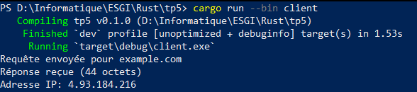

# Synthèse du cours 1 : 21/07/2025 de 9h45 à 19h00
# Notions abordées :

---

## 1. Installation de Rust  
Rust s’installe facilement via l’outil `rustup`, qui gère le compilateur `rustc` et le gestionnaire de paquets `cargo`.  

## 2. Syntaxe et conventions  
- **Typage** : Rust utilise des types précis (ex. `u32`, `i32`, `f32`) pour garantir la sécurité mémoire.  
- **Convention snake_case** : Variables et fonctions utilisent le format `snake_case`.  

## 3. Fonctions  
- **Déclaration** : `fn nom_fonction(param: Type) -> TypeRetour { … }`.  
- **Retour implicite** : La dernière expression sans point-virgule est retournée.  

## 4. Conditions  
- **`if` / `else`** : Dirige le flux selon une expression booléenne.  

## 5. Boucles  
- **`for`** : Itère sur une plage (`1..5`) ou une collection (`for x in coll`).  
- **`loop`** : Crée une boucle infinie, quittée avec `break`.  
- **`while`** : Répète tant que la condition est vraie.  

## 6. Tableaux  
- **Déclaration** : `let tab: [T; N] = [v1, v2, …]`.  
- **Itération** : `for x in tab.iter()` ou `for (i, x) in tab.iter().enumerate()`.  

## 7. Vecteurs  
- **Déclaration dynamique** : `let v = vec![v1, v2, …];`.  
- **Itération** : Identique aux tableaux via `.iter().enumerate()`.  

## 8. Mutabilité  
- **`mut`** : Rend une variable modifiable (`let mut x`).  
- **`&mut`** : Passe une référence mutable pour modifier un contenu sans déplacer la valeur.  

## 9. Lecture d’entrée utilisateur  
- **`std::io`** : `io::stdin().read_line(&mut s)` lit une ligne depuis l’utilisateur, à parser ensuite.  

---

## 10. `match`  
Le `match` permet le pattern‑matching sur des valeurs ou des enums, remplaçant souvent plusieurs `if/else` :  
```rust
match valeur {
    0 => println!("zéro"),
    1..=5 => println!("entre 1 et 5"),
    _ => println!("autre"),
}
```

---

## `struct`
Les `struct` définissent vos propres types en regroupant des champs nommés :
```rs
struct Personne {
    nom: String,
    age: u32,
}
```

## 12. `impl` et méthodes
On utilise `impl` pour associer des fonctions (méthodes) à une struct :
```rs
impl Personne {
    fn afficher(&self) {
        println!("Je suis {} et j'ai {} ans", self.nom, self.age);
    }
}
```

## 13. Notion de self
- `&self` : Méthode en lecture seule, emprunte une référence immuable.
- `&mut self` : Méthode en écriture, emprunte une référence mutable.
- `self` : Consomme l’objet, qui n’est plus utilisable après l’appel.

---

## 14. Travaux Pratiques 1
Création d’un menu interactif de gestion de comptes bancaires :
1. Afficher le solde
2. Retirer de l’argent
3. Afficher la liste des comptes
4. Quitter
Chaque option mobilise boucles, conditions, typage, mutabilité et lecture d’entrée.

---

## 15. Travaux Pratiques 2
Application des structs et méthodes avec un CompteBancaire :
- `struct CompteBancaire { nom: String, solde: f64 }`
- Méthodes via `impl` :
    - `afficher(&self)` — affiche solde et avertit si négatif
    - `deposer(&mut self, montant: f64)` — ajoute un montant positif
    - `retirer(&mut self, montant: f64)` — soustrait si fonds suffisants
    - `fermer(self)` — consomme le compte et affiche le dernier solde
    - `renommer(self, nouveau_nom: String) -> CompteBancaire` — retourne un nouveau compte renommé

Bonus : gestion de plusieurs comptes dans un `Vec<CompteBancaire>` et itération `.iter().enumerate()`.

---

## 16. Écriture dans un fichier  
Pour écrire dans un fichier, on utilise `std::fs::File::create` pour ouvrir/créer le fichier, puis `file.write_all(...)` ou le macro `writeln!(file, "...")` pour y écrire des octets ou des lignes (`use std::io::Write;`). Voir `resources/ecrire.rs`.

## 17. Lecture depuis un fichier  
Pour lire un fichier, on ouvre d’abord avec `std::fs::File::open`, on enveloppe dans un `BufReader`, puis on appelle `reader.read_to_string(&mut content)` pour charger tout le contenu dans une `String` (`use std::io::{BufReader, Read};`). Voir `resources/lire.rs`.  

---

## 18. Utilisation de chrono
La crate chrono permet de manipuler dates et heures :
```rs
use chrono::Utc;
let now = Utc::now();
println!("UTC: {}", now);
println!("Format FR: {}", now.format("%d/%m/%Y %H:%M:%S"));
```

---

## 19. Ownership et borrowing
- **Ownership** : Chaque valeur a un propriétaire unique ; lorsqu’il sort de scope, la mémoire est libérée.
- **Clonage** : `let b = a.clone();` produit une copie profonde pour conserver les deux valeurs.
- **Borrowing** : `&T` et `&mut T` prêtent une référence sans déplacer la valeur.
- **Membership** : Une `struct` possède ses champs, et emprunter un champ (`&user.nom`) permet de lire sans transférer la propriété.

---

## 20. Travaux Pratiques 3
Mise en pratique de la gestion de fichiers :
- `struct Fichier { nom: String, taille: u64 }`
- Méthodes via `impl` :
    - `new(nom: String) -> io::Result<Self>` — crée ou ouvre et lit la taille
    - `lire(&self)` — affiche le contenu
    - `ecrire(&mut self, texte: &str)` — écrase et met à jour la taille
    - `modifier(&mut self, texte: &str)` — ajoute en fin et met à jour
    - `supprimer(self)` — supprime le fichier
- **Menu interactif** : lire, créer, écrire, modifier, supprimer, quitter.

---

## 21. Programmation asynchrone avec `tokio`

La crate `tokio` permet d'écrire du code réseau et concurrentiel en Rust de manière non bloquante :

```rust
#[tokio::main]
async fn main() {
    // création d'un listener TCP
    let listener = TcpListener::bind("127.0.0.1:8080").await.unwrap();
    loop {
        let (socket, addr) = listener.accept().await.unwrap();
        println!("Connexion depuis {}", addr);
        tokio::spawn(async move {
            // gestion du client en tâche asynchrone
            handle_client(socket).await.unwrap();
        });
    }
}
```

* Utilise des tâches (`tokio::spawn`) pour chaque connexion.
* Les fonctions I/O asynchrones retournent des `Future` à `await`.

## 22. Travaux Pratiques 4

Mise en place d'un serveur TCP asynchrone qui :

1. Écoute sur un port (ex. `127.0.0.1:8080`).
2. Accepte plusieurs clients simultanément avec `tokio::spawn`.
3. Lit les messages ligne par ligne (`AsyncBufReadExt::lines`).
4. Enregistre chaque message horodaté dans un fichier de log protégé par un `Mutex` et partagé via `Arc<Mutex<File>>`.
5. Utilise `chrono::Utc` pour générer des timestamps en format RFC 3339.

**Objectifs** :

* Comprendre l'async/await en Rust.
* Manipuler `Arc`, `Mutex` et I/O asynchrone.
* Gérer la concurrence sans blocage.

```rust
// Extrait de TP4 (voir fichier complet)
use tokio::{net::TcpListener, sync::Mutex};
use tokio::io::{AsyncBufReadExt, BufReader};
use std::sync::Arc;
use std::fs::OpenOptions;
use chrono::Utc;

#[tokio::main]
async fn main() -> Result<(), Box<dyn std::error::Error>> {
    // Création du dossier de logs
    tokio::fs::create_dir_all("logs").await?;
    
    let listener = TcpListener::bind("127.0.0.1:8080").await?;
    let file = OpenOptions::new()
        .create(true).append(true)
        .open("logs/server.log")?;
    let file = Arc::new(Mutex::new(file));

    loop {
        let (socket, addr) = listener.accept().await?;
        let file = Arc::clone(&file);
        tokio::spawn(async move {
            let mut reader = BufReader::new(socket).lines();
            while let Some(line) = reader.next_line().await.unwrap() {
                let entry = format!("[{}] {}\n", Utc::now().to_rfc3339(), line);
                let mut f = file.lock().await;
                f.write_all(entry.as_bytes()).unwrap();
            }
        });
    }
}
```

---

## 23. Travaux Pratiques 5

**Client et Serveur DNS Simples** :

* Implémentation UDP avec `UdpSocket`.
* Parser et construire des messages DNS (RFC 1035) : en-tête, question, réponse.
* Table DNS statique (`HashMap<&str, [u8; 4]>`).
* Sérialisation/désérialisation binaire et envoi/réception de paquets.

**Fichiers clés** : `src/server.rs`, `src/client.rs`.

**Captures d’écran :**

**Client**



**Server**


---

## 24. Travaux Pratiques 6

**Implémentation d’un Protocole Personnalisé** :

* Définir un format de message (opcode, longueur, payload).
* Client/serveur TCP pour gérer le protocole, état de session et erreurs.
* Sérialisation/desérialisation manuelle ou via `serde`.

**Fichiers clés** : `src/server.rs`, `src/client.rs`.

**Captures d’écran :**

**Client**


**Server**


---

## 25. Travaux Pratiques 7

**Serveur et Client WebSocket** :

* Utilisation de `tokio-tungstenite` pour le handshake et les messages WebSocket.
* Gestion d’événements texte et binaire.
* Communication full‑duplex et gestion de plusieurs connexions.

**Fichiers clés** : `src/server.rs`, `src/client.rs`.

**Captures d’écran :**

**Client**


**Server**


